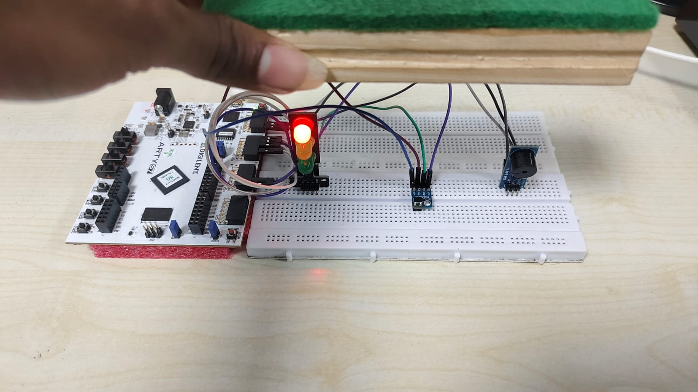
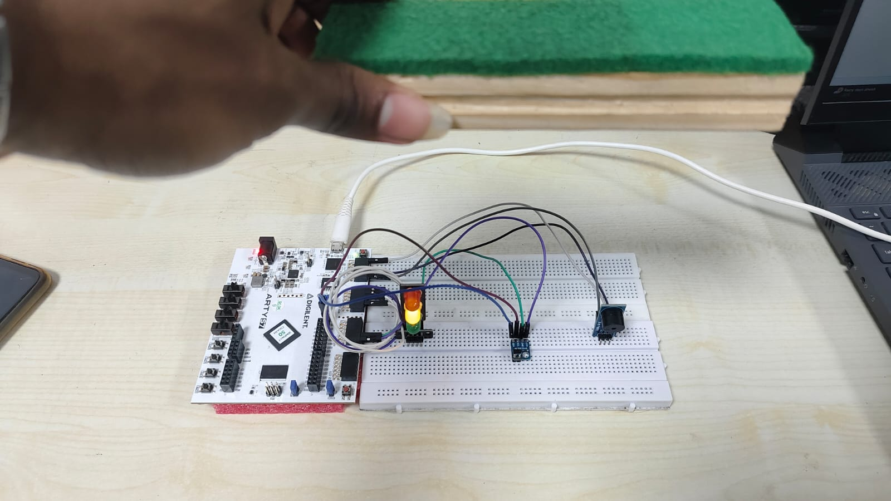
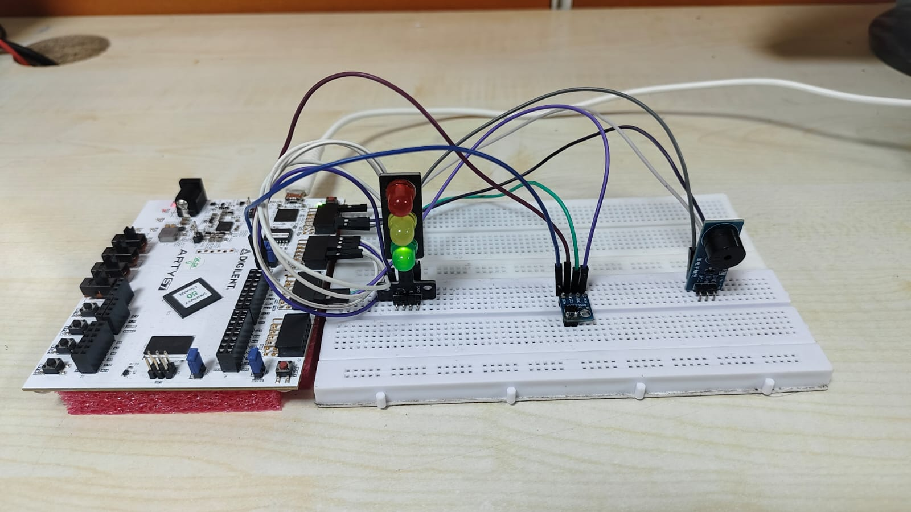

# Real-Time-Collision-Detection-System-Using-Arty-S7-FPGA-Laser-Ranging-Sensor

## Project Overview

Real-Time Collision Detection System using Arty S7 FPGA and VL53L0X LiDAR sensor. Implements an AXI-based MicroBlaze soft processor for I2C communication to measure distance and trigger alerts. Designed for high-speed, accurate object detection in embedded and automotive safety applications.

---

# ✅ Key Features
- **FPGA-Based Design**
  - MicroBlaze processor
  - AXI IIC for VL53L0X sensor
  - AXI GPIO for RGB LED alerts, Buzzer alerts
  - AXI UART Lite for serial output
- **Web Dashboard**
  - Real-time distance monitoring
  - Logging to CSV
  - Live stats: messages/sec, data rate, average message size
  - Filters and download options
- **Responsive UI** with modern styling (HTML, CSS, JavaScript)

##  🛠 Hardware Required 

- **FPGA Board:** Arty S7-50
- **Sensor:** VL53L0X Time-of-Flight (LiDAR) Sensor
- **Other Components:** RGB LEDs and Buzzer for distance alert
- **UART Communication:** For serial data output to PC or web server

---

## 💻 Software & Tools
- **Vivado Design Suite** – FPGA hardware design
- **Vitis IDE** – MicroBlaze software development
- **Python 3.8+**
- **Flask** for the web server
- **pySerial** for UART communication

---

## Workflow / Design Steps

### **1. Hardware Design (Vivado)**
- Create a new Vivado project for Arty S7 FPGA.
- Add a **MicroBlaze soft processor** with AXI Interconnect.
- Integrate **AXI IIC IP core** for VL53L0X sensor communication.
- Integrate **AXI UART IP core** for Website communication.
- Add **AXI GPIO IP** for RGB LED, Buzzer control.
- Connect to **BRAM controllers** and configure address mapping.
- Insert the XDC File.
- Validate design, generate bitstream, and export to Vitis.

### **2. Software Development (Vitis)**
- Create a new Vitis application project using the exported hardware.
- Include VL53L0X driver and initialize the sensor via I2C.
- Read distance measurements in real time.
- Apply logic to control **RGB LEDs** and **Buzzer** based on distance thresholds.
- Build and load the application on FPGA.

### **Web Interface**
- A Flask-based application runs on the host PC.
- Reads UART data from FPGA in real time.
- Streams data to the web page using Server-Sent Events (SSE).
- Displays live statistics, logs data, and allows CSV downloads.
- Provides filtering and search options for easier analysis.

---

###  🔍 Project Architecture 

VL53L0X Sensor <--I2C--> MicroBlaze on FPGA
|
AXI UART Lite
|
Host PC (Flask App)
|
Web Dashboard

---

### Project Code

The full source code 
  1. Vitis Code: ['Code/vitis.c'](Code/vitis.c)
  2. Website Code: ['Code/website.py'](Code/website.py)
  3. XDC File: ['XDC/pins.xdc](XDC/pins.xdc)

---

### Modifications in code

- Change the port in the python code according to your port(i.e COM 7,COM 9)
- Change the distance value according to your preception.

---

### Output

---

### ✅ Features of Web Dashboard
- Real-time streaming of FPGA UART data
- Auto-scrolling and timestamped message display
- Logging with start/stop toggle and CSV download
- Live performance statistics:
  - Total messages
  - Data rate
  - Average message size
  - Last received message time
- Filter and search options for received data
- Responsive design for mobile and desktop

---

## ✅ Applications
- **Automotive safety**: Preventing forward collisions by detecting obstacles.
- **Robotics**: Obstacle detection for autonomous navigation.
- **Industrial automation**: Proximity-based safety systems.

---

## 👥 Contributors

**Ragul T**
Special thanks to collaborators & mentors
**Tharun Babu V**
--- 

## 📜 License
This project is open-sourced under the MIT License. See the ['LICENSE'](LICENSE) file for details.

---

